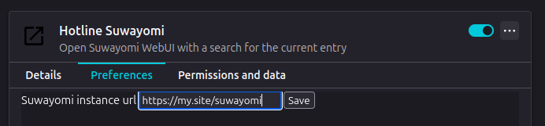

# Hotline Suwayomi

This is a [*very* simple](./dynasty.js) add-on/extension, which adds a link on
pages of manga sites supported by Mihon, allowing you to quickly open them in
Suwayomi.

All you need to do before this works is go to the add-on's settings
([Firefox](about:addons)) and set the URL of the Suwayomi instance you want to
use. This can be a `http://localhost:1234` or `https://9.8.7.6` or `https://serious.manga/`
or whatever you want, but it *does* have to be a valid URL, and so it must start
with the protocol (generally either `http` or `https`).

## Currently supported

### Browsers

1. Firefox

### Sites

1. Dynasty-Scans
    - Issues
    - Series
    - Doujins
    - Chapters
    - Anthologies

    > [!NOTE]
    > As the base Keiyoushi/Mihon extension does not support any other type of page,
    > please avoid making feature request just asking for wider support. However, if
    > the Mihon extension starts supporting more things and this add-on isn't
    > updated, don't hesitate at all!

## Contributing

I mean, sure? There's like barely a hundred lines of code right now, but this
could definitely be improved. I don't particularly like or know much about
HTML/CSS/JS, so if you have any beautification PR I'd love to take a look.

If you want to add support for another site, I'd be similarly open to PRs,
since my main use-case for this is Dynasty-Scans (and maybe MangaDex one day).
To make this, I just a) looked at the way Dynasty-Scans's extension handled
intents/deeplinks, and b) tried to open a dynasty-scans.com link through the
extension to confirm my code review. If the extension for the site you want to
add support to also allows this, then you can probably start from [`dynasty.js`](./dynasty.js).
